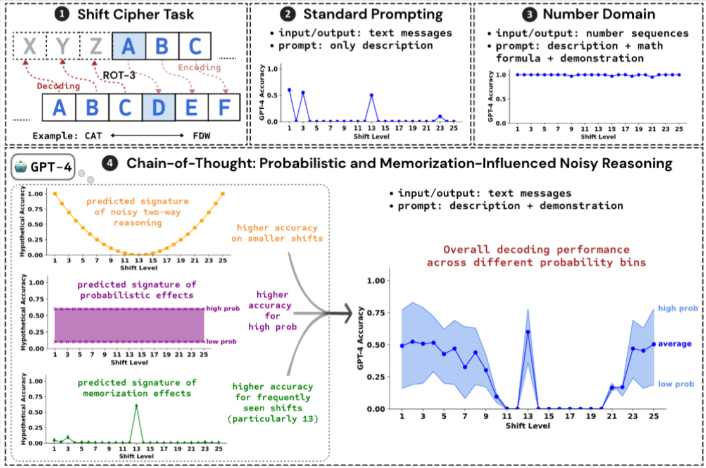

# deciphering_cot

Code implementation and data for the paper: 

**[Deciphering the Factors Influencing the Efficacy of Chain-of-Thought: Probability, Memorization, and Noisy Reasoning](https://arxiv.org/abs/2407.01687)**

[Akshara Prabhakar](https://aksh555.github.io/), [Thomas L. Griffiths](https://cocosci.princeton.edu/tom/index.php), [R. Thomas McCoy](https://rtmccoy.com/)



## Quickstart
### Data
We construct a dataset of seven-letter words divided into 5 probability bins {bin1 to bin 5} each having around 150 words (first 100 to evaluate GPT-4 and remaining to evaluate the logistic regression model that was fitted on the first 100 words). The binning is done based on the log probability value assigned by GPT-2. 

The seven-letter word dataset is in [seven_letter_words](seven_letter_words):
- bin1_prob.txt
- bin2_prob.txt
- bin3_prob.txt
- bin4_prob.txt
- bin5_prob.txt

### Shift cipher stimuli
Using the seven-letter word dataset, we prepare stimuli -- these are shift cipher encoded versions of the words from the 5 probability bins across 25 shift levels (1 to 25).

The stimuli are prepared for the different types of prompts we use: `standard`, `text_cot`, `math_cot`, `number_cot`.

Can be created by running,
```bash
python stimulus_generator.py --prompt_type <text_cot> 
```

### Evaluating LLMs on shift ciphers
- GPT-4: `run_openai.py`
- Llama 3.1: `run_llama.py`
- Claude 3: `run_claude.py`

Set appropriate OpenAI, Together, Anthropic keys in the environment before running evaluations.

For example to run experiments on GPT-4 with Text-CoT for shift_level=1 across all 5 bins run,
```bash
python run_openai.py --tasks text_cot1 --conditions bin1,bin2,bin3,bin4,bin5 --max_tokens 200 --prompt_type text_cot
```

To evaluate the generations, run
```bash 
python eval.py --prompt_type text_cot --create_stats_table
```
Run this after evaluating GPT-4 across all shift levels and bins. This will generate the evluation statistics for `text_cot` across all shift levels and the `{prompt_type}_train_table.tsv` file which is the train statistics table for fitting the logistic regression.

### Logistic regression
The logistic regression is implemented in R in [regression.ipynb](regression/regression.ipynb). The predictions on the test set are saved in `regression/text_cot_test_results.tsv`.

### Outputs
All model generations and outputs are stored in the `logs` directory.

## Citation
If you find this repository helpful, feel free to cite our [publication](https://arxiv.org/abs/2407.01687).
```
@inproceedings{prabhakar-etal-2024-deciphering,
    title = "Deciphering the Factors Influencing the Efficacy of Chain-of-Thought: Probability, Memorization, and Noisy Reasoning",
    author = "Prabhakar, Akshara  and
      Griffiths, Thomas L.  and
      McCoy, R. Thomas",
    editor = "Al-Onaizan, Yaser  and
      Bansal, Mohit  and
      Chen, Yun-Nung",
    booktitle = "Findings of the Association for Computational Linguistics: EMNLP 2024",
    month = nov,
    year = "2024",
    address = "Miami, Florida, USA",
    publisher = "Association for Computational Linguistics",
    url = "https://aclanthology.org/2024.findings-emnlp.212",
    pages = "3710--3724"
}
```
